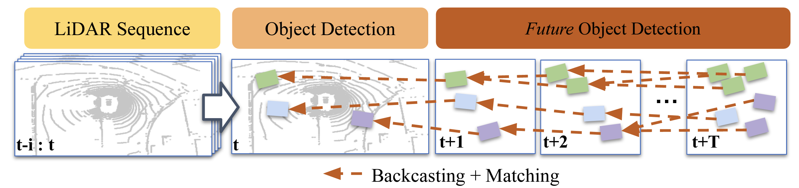
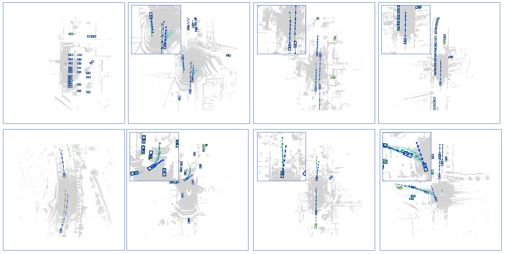

# (Refactor In Progress) Forecasting from LiDAR via Future Object Detection [[PDF](https://arxiv.org/pdf/2203.16297.pdf)]

Neehar Peri, Jonathon Luiten, Mengtian Li, Aljosa Osep, Laura Leal-Taixe, Deva Ramanan

<p align="center">  </p>

## Abstract 
Object detection and forecasting are fundamental components of embodied perception. These two problems, however, are largely studied in isolation by the community. In this paper, we propose an end-to-end approach for detection and motion forecasting based on raw sensor measurement as opposed to ground truth tracks. Instead of predicting the current frame locations and forecasting forward in time, we directly predict future object locations and backcast to determine where each trajectory began. Our approach not only improves overall accuracy compared to other modular or end-to-end baselines, it also prompts us to rethink the role of explicit tracking for embodied perception. Additionally, by linking future and current locations in a many-toone manner, our approach is able to reason about multiple futures, a capability that was previously considered difficult for end-to-end approaches. We conduct extensive experiments on the popular nuScenes dataset and demonstrate the empirical effectiveness of our approach. In addition, we investigate the appropriateness of reusing standard forecasting metrics for an end-to-end setup, and find a number of limitations which allow us to build simple baselines to game these metrics. We address this issue with a novel set of joint forecasting and detection metrics that extend the commonly used AP metrics from the detection community to measuring forecasting accuracy.

<p align="center">  </p>

## Contact
Any questions or discussion are welcome! Please raise an issue (preferred), or send me an email.

Neehar Peri [[nperi@cs.cmu.edu](mailto:nperi@cs.cmu.edu)]

## Installation 

Modified from [det3d](https://github.com/poodarchu/Det3D/tree/56402d4761a5b73acd23080f537599b0888cce07)'s original document.

### Requirements

- OS: Ubuntu 18.04
- Python: 3.7.10 
- PyTorch: 1.8.1
- spconv: 1.0
- CUDA: 10.1
- CUDNN: 7.6.5
- CMake 3.13.2 or higher
- [APEX](https://github.com/neeharperi/apex)
- [Sparse Convolutions (spconv)](https://github.com/neeharperi/spconv)

#### Notes
- Installing spconv is the most challenging part of the setup process. We would recommend checking out the issues and documentation from the [original implementation](https://github.com/traveller59/spconv) for common modifications to spconv and PyTorch. 

- As part of this code release we have installed this software and run the training and evaluation scripts on a new AWS instance to verify the installation process described below. 

### Basic Installation 

```bash
# Basic python libraries
conda create --name futuredet python=3.7.10
conda activate futuredet
git clone git@github.com:neeharperi/FutureDet.git
```

#### CUDA Extensions

```bash
# Set the CUDA/CuDNN path (change the path to your own CUDA location) 
export PATH=/usr/local/cuda-10.1/bin:$PATH
export CUDA_ROOT=/usr/local/cuda-10.1
export CUDA_HOME=/usr/local/cuda-10.1
export LD_LIBRARY_PATH=/usr/local/cuda-10.1/lib64:$LD_LIBRARY_PATH
```

#### spconv
```bash
git clone git@github.com:neeharperi/spconv.git
```

#### APEX

```bash
git clone git@github.com:neeharperi/apex.git
```

#### nuScenes end-to-end forecasting dev-kit

```bash
git clone git@github.com:neeharperi/nuscenes-forecast.git
```

#### Compiling RotatedNMS, APEX, and spconv

```bash
# Modify path to APEX, spconv, CUDA and CUDNN in FutureDet/setup.sh
bash setup.sh
```

## Use FutureDet
Be sure to change the paths in configs and syspath in the following files:
- train.py
- evaluate.py
- trajectory.py
- visualize.py
- det3d/datasets/nuscenes/nuscenes.py
- tools/create_data.py
- tools/dist_test.py
- 
### Benchmark Evaluation and Training

#### Prepare Data for Training and Evaluation 

```
# For nuScenes Dataset         
└── NUSCENES_DATASET_ROOT
       ├── samples       <-- key frames
       ├── sweeps        <-- frames without annotation
       ├── maps          <-- unused
       ├── v1.0-trainval <-- metadata
```

Data creation should be under the GPU environment.

```
# nuScenes 
#python tools/create_data.py nuscenes_data_prep --root_path NUSCENES_DATASET_ROOT --version v1.0-trainval --timesteps 7

```

In the end, the data and info files should be organized as follows

```
# For nuScenes Dataset 
└── NUSCENES_DATASET_ROOT
      ├── samples       <-- key frames
      ├── sweeps        <-- frames without annotation
      ├── maps          <-- unused
      |── v1.0-trainval <-- metadata and annotations
      |__ trainval_forecast
          |── infos_train_10sweeps_withvelo_filter_True.pkl <-- train annotations
          |── infos_val_10sweeps_withvelo_filter_True.pkl <-- val annotations
          |── dbinfos_train_10sweeps_withvelo.pkl <-- GT database info files
          |── gt_database_10sweeps_withvelo <-- GT database 
```


Use the following command to start a distributed training and evaluation. The models and logs will be saved to ```models/CONFIG_NAME```. Results will be save to ```results/CONFIG_NAME``` 

#### Constant Velocity Model
```bash
# Cars
python train.py --experiment FutureDetection --model forecast_n0

python evaluate.py --experiment FutureDetection --model forecast_n0 --forecast_mode velocity_constant  --cohort_analysis --extractBox

# Pedestrians
python train.py --experiment FutureDetection --model pedestrian_forecast_n0

python evaluate.py --experiment FutureDetection --model forecast_n0 --forecast_mode velocity_constant  --cohort_analysis --classname pedestrian --extractBox
```

#### FaF*
```bash
# Cars
python train.py --experiment FutureDetection --model forecast_n3

python evaluate.py --experiment FutureDetection --model forecast_n3 --forecast_mode velocity_forward  --cohort_analysis --extractBox

# Pedestrians
python train.py --experiment FutureDetection --model pedestrian_forecast_n3

python evaluate.py --experiment FutureDetection --model forecast_n3 --forecast_mode velocity_forward  --cohort_analysis --classname pedestrian --extractBox
```

#### FutureDet
```bash
# Cars
python train.py --experiment FutureDetection --model forecast_n3dtf

python evaluate.py --experiment FutureDetection --model forecast_n3dtf --forecast_mode velocity_dense  --cohort_analysis --extractBox

python evaluate.py --experiment FutureDetection --model forecast_n3dtf --forecast_mode velocity_dense  --cohort_analysis --K 5 --eval_only

# Pedestrians
python train.py --experiment FutureDetection --model pedestrian_forecast_n3dtf

python evaluate.py --experiment FutureDetection --model forecast_n3dtf --forecast_mode velocity_dense  --cohort_analysis --classname pedestrian --extractBox

python evaluate.py --experiment FutureDetection --model forecast_n3dtf --forecast_mode velocity_dense  --cohort_analysis --K 5 --classname pedestrian --eval_only

```
#### Evaluation Parameters
```
extractBox -> Uses modelCheckPoint to run inference on GPUs and save results to disk
tp_pct -> TP percentage thresholds for ADE@TP % and FDE@TP %. Setting tp_pct to -1 returns AVG ADE/FDE over all TP threholds.
static_only -> Rescores stationary objects to have higher confidence. Result from Table 1.
eval_only -> Uses cached results to run evaluation
forecast_mode -> Detection association method. [Constant Velocity -> velocity_constant, FaF* -> velocity_forward, FutureDet -> velocity_dense]
classname -> Select class to evaluate. car and pedestrian currently supported.
rerank -> Assignment of forecasting score. [last, first, average]
cohort_analysis -> Reports evaluation metrics per motion subclass static/linear/nonlinear.
K -> topK evaluation, only useful for FutureDet
```

### [Pre-trained Models](https://drive.google.com/drive/folders/1JwtWIxz8mb2JmdAcVWa4VBXTm3UBHasM?usp=sharing)

### To Do List
- Support Waymo and Argoverse 2.0 datasets
- Reimplement in MMDetection3D framework

## Acknowlegement
This project is not possible without multiple great opensourced codebases. We list some notable examples below.  

* [det3d](https://github.com/poodarchu/det3d)
* [second.pytorch](https://github.com/traveller59/second.pytorch)
* [CenterTrack](https://github.com/xingyizhou/CenterTrack)
* [CenterNet](https://github.com/xingyizhou/CenterNet) 
* [mmcv](https://github.com/open-mmlab/mmcv)
* [mmdetection](https://github.com/open-mmlab/mmdetection)
* [OpenPCDet](https://github.com/open-mmlab/OpenPCDet)
* [CenterPoint](https://github.com/tianweiy/CenterPoint)

If you find this codebase useful, please consider citing:

    @article{peri2022futuredet,
      title={Forecasting from LiDAR via Future Object Detection},
      author={Peri, Neehar and Luiten, Jonathon and Li, Mengtian and Osep, Aljosa and Leal-Taixe, Laura and Ramanan, Deva},
      journal={arXiv:2203.16297},
      year={2022},
    }

